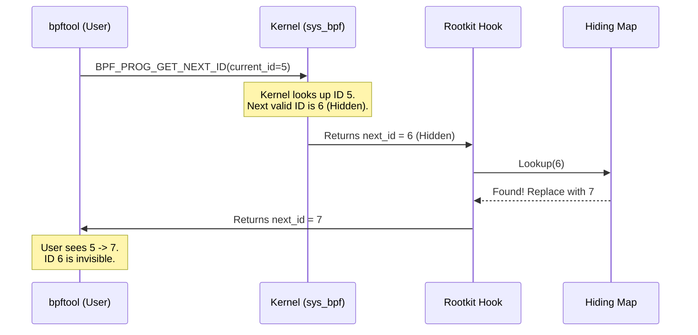

> **Disclaimer I have two versions here of my README, the first one is the one I got after I gave an LLM my readme I wrote and my research notes and asked him to explain things better and combine them, and the second one is my original one.**

**Oh and paste this into a MD viewer such as gitlab it looks fucking sick**

# eBPF Rootkit PoC: Stable Evasion

**A Proof of Concept for fully hiding eBPF programs from userspace enumeration tools (bpftool, etc.) by manipulating `sys_bpf` return values.**

> **Disclaimer:** I tested this primarily on Kernel 6.8.0-88-generic (VM), but from what I checked online (not thoroughly) it should work for kernels 5.8+ (and 5.5+ with slight modifications (removing BPF ringbuffer things)).

## Overview
Current eBPF visibility tools (like `bpftool`) rely on the `BPF_PROG_GET_NEXT_ID` command within the `sys_bpf` syscall to iterate through loaded programs. The kernel maintains these programs in a linked-list-like structure.
This PoC defeats this enumeration by acting as a "Man-in-the-Middle" inside the kernel. It hooks the `sys_bpf` syscall and dynamically edits the returned IDs to "skip" over hidden programs.

## Architecture & Attack Flow

The system operates by intercepting the communication between the user's tool and the kernel.

### Components

1.  **The Changer (Kernel Hook):**
      * **Hook:** `kprobe/sys_bpf` (Entry) and `kretprobe/sys_bpf` (Exit).
      * **Mechanism:** It reads the syscall parameters on entry. On exit, it checks if the returned `next_id` matches a hidden program. If it does, it uses `bpf_probe_write_user` to overwrite the return value in userspace memory with the *next valid* ID.

2.  **The Auditor (Kernel Hook):**
      * **Hook:** `sys_bpf` (Entry).
      * **Mechanism:** Monitors for `BPF_PROG_LOAD`. When a new program is loaded, it sends an event to the Userspace Manager via a Ring Buffer to trigger a map update.

3.  **The Userspace Manager:**
      * **Role:** Maintains the "Source of Truth" (`hiding_map`).
      * **Logic:** When notified of a change, it rescans the system, subtracts the hidden IDs, and rebuilds the map that tells the kernel hook which IDs to skip.
      * **Lifecycle Tracking:** Because there is no `sys_close_bpf_prog`, I hooked the internal kernel function `bpf_prog_put` (stable since v5.2) to detect when a program is unloaded.
  
## Implementation Challenges & Constraints

Developing this PoC required bypassing several standard kernel protections and architectural limitations.

### 1. The `bpf_override_return` Dead End
Initially, the plan was to use `bpf_override_return` to cleanly alter the syscall return value.
* **The Barrier:** This helper is only available if the kernel is compiled with `CONFIG_BPF_KPROBE_OVERRIDE` and `CONFIG_FUNCTION_ERROR_INJECTION`. Most production kernels (including Ubuntu generic) do not enable this by default for `sys_bpf`.
* **The Pivot:** I had to resort to `bpf_probe_write_user`. This allows modifying the data *returned* to userspace memory, rather than the return code itself. While less "clean," it is significantly more portable across standard distro kernels.

### 2. Hook Selection Nightmare (`fentry` vs. `kprobe`)
I attempted to use `fentry` and `fexit` hooks, which theoretically allow for better argument access.
* **The Barrier:** Accessing and modifying the `uattr` (userspace attributes) pointer proved unstable or restricted in these newer hook types for this specific syscall path.
* **The Pivot:** I reverted to standard `kprobes` (entry) and `kretprobes` (exit). This required manually saving the context (syscall parameters) in a map during the entry hook so the exit hook could access them to perform the ID substitution.

### 3. Secure Boot & Lockdown Mode
During local testing, standard tracepoint (`tp`) hooks failed silently or generated errors, even when helper documentation suggested they should work.
* **The Discovery:** Systems with Secure Boot enabled often default to a Kernel Lockdown mode. This mode implicitly restricts BPF features that can modify kernel execution flow or trace arbitrary events.
* **The Fix:** Development was moved to a VM with Secure Boot disabled to verify logic. A future "Lockdown Bypass" using userspace memory editing (ring buffer method) is planned to address this.

### 4. The "Last Element" Iteration
The logic for handling the end of the program list went through several failed iterations:
* **Attempt 1:** Returning a fake "End of List" error code. **Failed:** Caused `bpftool` to crash or report invalid arguments.
* **Attempt 2:** "Phantom Mappings" (creating fake IDs to pad the list). **Failed:** Too complex to maintain state consistency; introduced race conditions.
* **Final Success:** Hooking the *entry* of the `GET_NEXT_ID` call for the *second-to-last* program and modifying the `start_id` to point to the *actual* last program. This tricks the kernel's own iterator into returning the clean "EOF" signal naturally.

***

## The "Last Element" Edge Case (Novelty)

Standard ID skipping fails when the hidden program is the **last** one in the kernel's list. If the hook simply returns "next\_id = EOF" too early or returns an invalid ID, tools like `bpftool` crash or show errors.

**My Solution:**
The rootkit monitors for queries regarding the **second-to-last** legitimate program.
  * **The Trick:** I hook the beginning of the `BPF_PROG_GET_NEXT_ID` call. When the `start_id` is the program *before* my hidden program, I hot-swap the `start_id` to be my last hidden program.
  * **The Result:** The kernel sees the request as coming *from* the last program, and naturally returns "No more programs" (EOF). The userspace tool receives a clean exit code and never realizes it missed the end of the list.

## Known Issues & Solutions

### 1\. The `dmesg` Warning

  * **Problem:** Using `bpf_probe_write_user` causes the kernel to log: `rootkit[...] is installing a program with bpf_probe_write_user helper that may corrupt user memory!` This is a primary Indicator of Compromise (IOC).
  * **Proposed Solution:** A secondary userspace program running as root could use a Ring Buffer to receive "write requests" from the BPF program and perform the memory edits from userspace, avoiding the helper entirely.

### 2\. The Update Race Condition

  * **Problem:** When the Userspace Manager updates the `hiding_map`, it currently clears the map and rebuilds it. If `bpftool` runs exactly during this rebuild, the hidden programs might briefly appear.
  * **Solution:** The update process should happen entry-by-entry to minimize the window, or use a double-buffering strategy (swap maps atomically).

### 3\. Subsystem Visibility

  * **Problem:** While `bpftool prog show` is clean, you can still see the rootkit if you inspect specific subsystems (e.g., `cat /sys/kernel/debug/kprobes/list`).
  * **Solution:** Additional hooks are needed on `sys_read` or `sys_getdents64` to scrub the output of these specific debugfs files.

### 4\. Lockdown Mode

  * **Problem:** `bpf_probe_write_user` and `kprobes` may be restricted in Kernel Lockdown mode (often enabled with Secure Boot).
  * **Solution:** The "Userspace Write" method (Solution \#1 above) might bypass the helper restriction, but `kprobes` restrictions are harder to circumvent without an exploit.

___
# **And now for the real readme I wrote:**

## Description
This program is a POC for a tool that can hide EBPF programs FULLY (including maps, links, and sub system searches) and in the future also processes. 
Right now the only thing I have implemented is ability to hide BPF programs from listing all bpf programs. 
This has not been tested on any other computer other than a VM that I have running `6.8.0-88-generic`. But from a small non in-depth check I did, the earliest version it could work on right now is 5.8, and with some slight modifications (removing the ring buffers), 5.5.

This is essentially using EBPF to fuck EBPF

PS: I'm sorry for the messy documentation I'm really tired :( 

## What is EBPF: 
EBPF is an "extension" of BPF (Berkeley Packet Filter) which is essentially just a mini VM that runs in the kernel that allows you to filter packets really fucking fast, tcpdump uses it. 
EBPF takes this like 10 steps further and allows you to set a lot of different hooks including but not limited to: 
- All syscalls (either through maintained tracing methods or through hooking `raw_syscalls:sys_enter`)
- A really respectable amount of internal kernel functions.
- Allows insertion of probes (just adding an int 3) into your user space applications. 
- XDP (eXpress Data Path) which is the earliest point a packet arrives to the computer. Sometimes, these hooks can actually run in your NIC, this is referred to as **offloaded XDP** and is available on some NICs. This happens a lot before the kernel allocates the `sk_buff`.
- cgroup hooks (don't really know what use case they for that)
- Hook when an `sk_buff` is allocated for a packet for more informed decision making for packets. 
Check out https://docs.ebpf.io/linux/program-type/ for more. 
In addition to letting you observe, EBPF also allows you to, in very special occasions: interfere/change data:
- `bpf_override_return` allows you to override the return of the function you're hooking, but only if you're hooking using Kprobes and if your kernel was compiled with the `CONFIG_BPF_KPROBE_OVERRIDE` config option and even if it was it still only works on functions that have the  `ALLOW_ERROR_INJECTION` tag in the kernel code. 
- `bpf_probe_write_user` (which is what I will be using here) allows you to write to user memory, you can run this function in most if not all tracing programs, but there is a huge downside to using this. Everytime you load a program that uses this, it writes a message in dmesg about it. **More in the end about how to potentially bypass this**
Essentially, if used correctly. You can do a lot of really cool things that were traditionally done only using kernel modules using EBPF. 

***Disclaimer:*** I will be referring using the concepts EBPF and BPF interchangeably during this explanation, EBPF is **NOT** BPF but in this case when I say BPF I mean EBPF. 

## Explanation 
The way usermode programs are able to see which BPF programs are loaded is through enumeration using the *bpf* syscall using a special command called `BPF_PROG_GET_NEXT_ID`, this is because bpf programs are stored in the kernel as a linked list, the pseudo of it is you essentially run something that equates to: `next_id = get_next_program_id(current_id)`. 
I need to hook the exit of the bpf syscall in order to change the next_id that the usermode gets. That requires me to get the syscall's parameters that it was called with. 
I can't do that on the return hook of the syscall, but I can do it on the entry hook of the syscall. 
So what I did is that I hooked the entry of the syscall, and read the parameters straight for the kernel's registers and then passed it to a map (a shared bpf data structure that allows for communication to different bpf programs or usermode programs), that the exit hook will get. 
Now I have an exit hook with the parameters of the syscall. What happens in the exit is that I check if the next_id is one that I want to watch out for and if it is I replace it with the one I have in my hiding map *explained below*. 
Another thing that also happens in the bpf entry hook is that I check if the command is `BPF_PROG_LOAD` and if it is, I send an event to the usermode manager program to alert it that a new program has been loaded to update the hiding map, and its internal state of the BPF programs that it has (in order to know the right values to replace in order to hide relevant programs).
There was an issue that if the last BPF program in the linked list is one/ones that we want to hide, because we couldn't change the return value to indicate that it was the end of the list we would have to add a fake value to it and that looks really suspicious because it tried to get info about that program and it just didn't exist. So what it does instead is that it waits for when you try to enumerate and the `current_id` is the last legit bpf program before your bpf program (which is the last one) (also relevant for when you have more than one its smart), and then if it is it changes the value of the current_id to the real last one so that it returns that that's the last entry, therefore "tricking" the enumeration. 
There's no real comfortable way that I found to hook when a BPF program exits, so what I had to do instead is hook an internal kernel function that seems to be very stable, supposedly hasn't changed since it's been added in version  5.2 ~2019. I hooked the `bpf_prog_put` which is the function that basically removes a reference to an ebpf program. Whenever this function is hit the usermode manager gets an event that a program was unloaded and updates the hiding map accordingly. 

This leaves me with an updated map with its keys being what we want to hide and it's values being what we want to change them to, and another map to handle when our programs are last. 

## Todos/Tofix 

**Problem:** Every time you load a program that uses `bpf_probe_write_user` you get a warning in dmesg. 
**Solution 1:** Either edit dmesg (shit solution, you have to either write a kernel module or to find a way to edit kernel memory in a normal way) 
**Solution 2:** Use another usermode program running as root to edit the usermode memory you need, do this by adding a ring buffer that gets a struct that has the destination pointer the length of what you want to write there and what you want to write there. 

**Problem:** You can still see the maps that your program creates and its links
**Solution:** Implement basically the same thing as the program ones just a lot simpler that hooks the commands in the bpf syscall that have to do with maps and links. 

**Problem:** If you look at the subsystems' you're hooking's objects you can see the links to your programs (for example: to see all kprobes you can just cat `/sys/kernel/debug/kprobes/list` )
**Solution:** MORE HOOKS, just this time on the syscalls/functions that allow you to see info about the subsystem that includes it's links. 

**Problem:** The update process first clears hiding_map entirely, then enumerates all programs, then rebuilds the map entries one by one. Between clearing and fully repopulating, the map is either empty or incomplete. If someone runs bpftool prog list during this window, changer_exit looks up the hidden ID, finds nothing in the empty map, and lets the real ID pass through. The rootkit's programs become briefly visible until the rebuild finishes.
**Solution:** Minimize the time window that the program is left with an incomplete map by updating the map entry by entry and then at the very end of the enumeration for the update check for any stale entries that can be deleted. 

