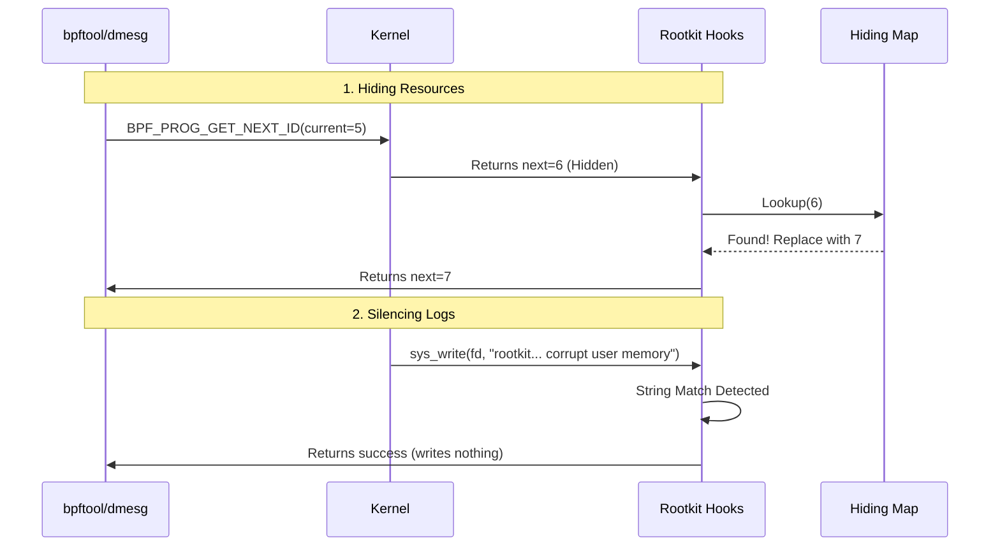

> **Disclaimer I have two versions here of my README, the first one is the one I got after I gave an LLM my readme I wrote and my research notes and asked him to explain things better and combine them, and the second one is my original one for my first session and the original for my second session because its almost 2am and I'm too lazy to combine them.**

**Oh and paste this into a MD viewer such as gitlab it looks fucking sick**
-----

# eBPF Rootkit PoC: Stable Evasion & Log Suppression

**A Proof of Concept for fully hiding eBPF programs, maps, and kernel warnings from userspace enumeration tools by manipulating `sys_bpf` and `sys_write`.**

> **Disclaimer:** This software has been tested primarily on Kernel 6.8.0-88-generic.

## Overview

Current eBPF visibility tools (like `bpftool`) rely on specific commands within the `sys_bpf` syscall (`BPF_PROG_GET_NEXT_ID`, `BPF_MAP_GET_NEXT_ID`) to iterate through loaded objects. Additionally, the kernel emits loud warnings (`dmesg`) when helper functions like `bpf_probe_write_user` are used.

This PoC defeats these controls by acting as a "Man-in-the-Middle" inside the kernel:

1.  **Hiding:** It hooks `sys_bpf` to surgically remove specific Program and Map IDs from enumeration lists.
2.  **Silencing:** It hooks `sys_write` to scrub the specific "corrupt user memory" warning messages generated by the rootkit itself.

## Architecture & Attack Flow

The system operates via three main kernel-space components and one userspace manager.

### Components

1.  **The Changer (Resource Hider):**

      * **Hook:** `kprobe/sys_bpf` (Entry) and `kretprobe/sys_bpf` (Exit).
      * **Mechanism:** Intercepts both `BPF_PROG_GET_NEXT_ID` and `BPF_MAP_GET_NEXT_ID`. If the kernel returns an ID marked as hidden, it overwrites the return value in userspace memory with the next valid ID in the chain.
      * **Features:** Solves the "Last Element" edge case by manipulating the `start_id` of the *preceding* call to force a natural "End of List" (ENOENT) return from the kernel.

2.  **The Silencer (Log Suppressor):**

      * **Hook:** `sys_write` (Entry).
      * **Mechanism:** Scans the buffer of write syscalls. If the buffer contains the specific kernel warning string regarding `bpf_probe_write_user`, it suppresses the output by zeroing the buffer or preventing the write, effectively blinding `dmesg`.

3.  **The Auditor & Manager:**

      * **Role:** Maintains the "Source of Truth" map.
      * **Lifecycle:** Hooks the internal function `bpf_prog_put` to track program unloading and triggers a userspace rescan to update the hiding maps.

## Research Challenges & Constraints

This project required navigating several dead-ends in kernel security features.

### 1\. The Secure Boot / Lockdown Rabbit Hole

The helper `bpf_probe_write_user` is disabled when the kernel is in Lockdown Mode (automatically enabled by Secure Boot).

  * **Investigation:** I attempted to bypass this via `unlockdown` (deprecated), DKMS signing (requires physical access to enroll keys), and direct UEFI manipulation (MOK).
  * **Conclusion:** Bypassing Lockdown purely via software on a hardened system is not feasible without a kernel exploit. **Physical access is required** to enroll a Machine Owner Key (MOK) or disable Secure Boot to allow this rootkit to function.

### 2\. The `dmesg` Suppression Struggle

Hiding the kernel warning proved difficult due to how `dmesg` reads the ring buffer.

  * **Attempt 1 (`sys_read`):** Hooking `openat` on `/dev/kmsg` and then hooking `read`.
      * *Result:* **Failure.** Zeroing the buffer resulted in `dmesg` printing endless empty lines `[ 0.000000]`. The timestamps and formatting persisted even if the content was empty.
  * **Attempt 2 (`sys_write`):** Hooking the `write` syscall itself.
      * *Result:* **Success (mostly).** By catching the data before it hits the terminal output, we can scrub the specific warning line.

### 3\. The "Last Element" Iteration

The logic for handling the end of the program list went through several failed iterations:

  * **Attempt 1:** Returning a fake "End of List" error code caused tools to crash.
  * **Solution:** Hooking the *entry* of the `GET_NEXT_ID` call for the *second-to-last* program and modifying the `start_id` to point to the *actual* last program. This tricks the kernel's own iterator into returning the clean "EOF" signal naturally.

## Current Limitations & TODOs

### 1\. `dmesg` Formatting Gaps

The current `sys_write` hook works for standard `dmesg` output. However:

  * **JSON Output (`dmesg --json`):** Uses multiple fragmented write calls. The current hook does not maintain state across writes, so it fails to catch the split strings.
  * **Human/Pager Output (`dmesg -H`):** Uses a different formatting/paging mechanism (less) that bypasses the current string matching logic.
  * **Grep:** Piping `dmesg | grep` occasionally bypasses the hook depending on buffer chunking.

### 2\. Subsystem & Link Visibility

  * **Links:** `BPF_LINK_GET_NEXT_ID` is not yet hooked. Links are currently visible.
  * **Debugfs:** Standard subsystem paths (e.g., `/sys/kernel/debug/kprobes/list`) still show the attached kprobes. These need to be scrubbed via `getdents64` or `read` hooks.

### 3\. Update Race Condition

When the Userspace Manager updates the hiding maps, it currently deletes the map and rebuilds it. Theoretically, there is a race condition where a `bpftool` scan occurring exactly during this rebuild would reveal the hidden programs. (Note: Extensive VM testing has not yet triggered this, but the logic remains flawed).

## Prerequisites

  * **Kernel:** 5.8+ (Required for Ring Buffer support).
  * **Secure Boot:** Must be **DISABLED** (or MOK manually enrolled).
  * **Root Access:** Required for initial loading.

-----

### Research Note on `bpf_probe_write_user` Internals

Analysis of `BPF_CALL_3` in `linux/v6.18` reveals strictly enforced context checks. The kernel ensures `access_ok()` and `nmi_uaccess_okay()` pass, preventing use in hardware interrupts or non-user contexts. This confirms that our dependency on user-context syscall hooking (`sys_bpf`, `sys_write`) is the only valid path for using this helper; it cannot be used from arbitrary tracepoints deep in the kernel stack.
___
# **And now for the real readme I wrote:**

## Description
This program is a POC for a tool that can hide EBPF programs FULLY (including maps, links, and sub system searches) and in the future also processes. 
Right now the only thing I have implemented is ability to hide BPF programs from listing all bpf programs. 
This has not been tested on any other computer other than a VM that I have running `6.8.0-88-generic`. But from a small non in-depth check I did, the earliest version it could work on right now is 5.8, and with some slight modifications (removing the ring buffers), 5.5.

This is essentially using EBPF to fuck EBPF

PS: I'm sorry for the messy documentation I'm really tired :( 

## What is EBPF: 
EBPF is an "extension" of BPF (Berkeley Packet Filter) which is essentially just a mini VM that runs in the kernel that allows you to filter packets really fucking fast, tcpdump uses it. 
EBPF takes this like 10 steps further and allows you to set a lot of different hooks including but not limited to: 
- All syscalls (either through maintained tracing methods or through hooking `raw_syscalls:sys_enter`)
- A really respectable amount of internal kernel functions.
- Allows insertion of probes (just adding an int 3) into your user space applications. 
- XDP (eXpress Data Path) which is the earliest point a packet arrives to the computer. Sometimes, these hooks can actually run in your NIC, this is referred to as **offloaded XDP** and is available on some NICs. This happens a lot before the kernel allocates the `sk_buff`.
- cgroup hooks (don't really know what use case they for that)
- Hook when an `sk_buff` is allocated for a packet for more informed decision making for packets. 
Check out https://docs.ebpf.io/linux/program-type/ for more. 
In addition to letting you observe, EBPF also allows you to, in very special occasions: interfere/change data:
- `bpf_override_return` allows you to override the return of the function you're hooking, but only if you're hooking using Kprobes and if your kernel was compiled with the `CONFIG_BPF_KPROBE_OVERRIDE` config option and even if it was it still only works on functions that have the  `ALLOW_ERROR_INJECTION` tag in the kernel code. 
- `bpf_probe_write_user` (which is what I will be using here) allows you to write to user memory, you can run this function in most if not all tracing programs, but there is a huge downside to using this. Everytime you load a program that uses this, it writes a message in dmesg about it. **More in the end about how to potentially bypass this**
Essentially, if used correctly. You can do a lot of really cool things that were traditionally done only using kernel modules using EBPF. 

***Disclaimer:*** I will be referring using the concepts EBPF and BPF interchangeably during this explanation, EBPF is **NOT** BPF but in this case when I say BPF I mean EBPF. 

## Explanation 
The way usermode programs are able to see which BPF programs are loaded is through enumeration using the *bpf* syscall using a special command called `BPF_PROG_GET_NEXT_ID`, this is because bpf programs are stored in the kernel as a linked list, the pseudo of it is you essentially run something that equates to: `next_id = get_next_program_id(current_id)`. 
I need to hook the exit of the bpf syscall in order to change the next_id that the usermode gets. That requires me to get the syscall's parameters that it was called with. 
I can't do that on the return hook of the syscall, but I can do it on the entry hook of the syscall. 
So what I did is that I hooked the entry of the syscall, and read the parameters straight for the kernel's registers and then passed it to a map (a shared bpf data structure that allows for communication to different bpf programs or usermode programs), that the exit hook will get. 
Now I have an exit hook with the parameters of the syscall. What happens in the exit is that I check if the next_id is one that I want to watch out for and if it is I replace it with the one I have in my hiding map *explained below*. 
Another thing that also happens in the bpf entry hook is that I check if the command is `BPF_PROG_LOAD` and if it is, I send an event to the usermode manager program to alert it that a new program has been loaded to update the hiding map, and its internal state of the BPF programs that it has (in order to know the right values to replace in order to hide relevant programs).
There was an issue that if the last BPF program in the linked list is one/ones that we want to hide, because we couldn't change the return value to indicate that it was the end of the list we would have to add a fake value to it and that looks really suspicious because it tried to get info about that program and it just didn't exist. So what it does instead is that it waits for when you try to enumerate and the `current_id` is the last legit bpf program before your bpf program (which is the last one) (also relevant for when you have more than one its smart), and then if it is it changes the value of the current_id to the real last one so that it returns that that's the last entry, therefore "tricking" the enumeration. 
There's no real comfortable way that I found to hook when a BPF program exits, so what I had to do instead is hook an internal kernel function that seems to be very stable, supposedly hasn't changed since it's been added in version  5.2 ~2019. I hooked the `bpf_prog_put` which is the function that basically removes a reference to an ebpf program. Whenever this function is hit the usermode manager gets an event that a program was unloaded and updates the hiding map accordingly. 

This leaves me with an updated map with its keys being what we want to hide and it's values being what we want to change them to, and another map to handle when our programs are last. 

## Todos/Tofix 

**Problem:** Every time you load a program that uses `bpf_probe_write_user` you get a warning in dmesg. 
**Solution 1:** Either edit dmesg (shit solution, you have to either write a kernel module or to find a way to edit kernel memory in a normal way) 
**Solution 2:** Use another usermode program running as root to edit the usermode memory you need, do this by adding a ring buffer that gets a struct that has the destination pointer the length of what you want to write there and what you want to write there. 

**Problem:** You can still see the maps that your program creates and its links
**Solution:** Implement basically the same thing as the program ones just a lot simpler that hooks the commands in the bpf syscall that have to do with maps and links. 

**Problem:** If you look at the subsystems' you're hooking's objects you can see the links to your programs (for example: to see all kprobes you can just cat `/sys/kernel/debug/kprobes/list` )
**Solution:** MORE HOOKS, just this time on the syscalls/functions that allow you to see info about the subsystem that includes it's links. 

**Problem:** The update process first clears hiding_map entirely, then enumerates all programs, then rebuilds the map entries one by one. Between clearing and fully repopulating, the map is either empty or incomplete. If someone runs bpftool prog list during this window, changer_exit looks up the hidden ID, finds nothing in the empty map, and lets the real ID pass through. The rootkit's programs become briefly visible until the rebuild finishes.
**Solution:** Minimize the time window that the program is left with an incomplete map by updating the map entry by entry and then at the very end of the enumeration for the update check for any stale entries that can be deleted. 

___ 
## The other readme: 

I implemented 2 additional features: 
- Dmesg hiding
- Hiding maps now as well.

After a lot of research about secure boot and a deep rabbit hole of UEFI booting in linux, I reached a conclusion that the most thesable way to bypass lockdown mode and by relation secure boot, is to have physical access to the computer and either sign your own MOK (Machine Owner Key) or allow insecure ones through shim, the first stage UEFI bootloader. 
Why this is partly true: Secure boot and by relation, lockdown mode. Are only allowed on big linux distros (debian, ubuntu, redhat, etc...), this is because in order to get shim (technically grub but shim gives him the signatures most of the time) to sign your distro, you have to get a microsoft signature. 

So after that rabbit hole, I decided to just silence dmesg, this was problematic because I can't use any god-mode like tools such as ptrace (for a lack of time to run), I have to use EBPF hooks, I first tried hooking read and emptied the buffer when reading what I don't want it to read. 
But that didn't work, the reason for that being was that it would still print things to the shell, but just empty lines: `[    0.000000] ` over and over again.
So I went for a different approach, I then hooked write syscall and checked if they were trying to write what I wanted to hide, that worked, I didn't see the logs anymore **partially** I'll explain later. 

After that I then implemented masks which work sort of the same as programs, nothing really exciting there. 

Downsides/TODOs: 
- Still need to implement links. Really easy, works the same as programs and maps. `bpf(BPF_LINK_GET_NEXT_ID, {start_id=281, next_id=0 => 282, open_flags=0}, 12)`
- Still need to hook subsystems that check if BPF tools are attached IP binary etc...
- Dmesg hook doesn't work with dmesg --json. When you use it with json it uses multiple writes that I don't keep track of right now.  - To fix it I would need to make it be aware of the state of the program at the moment, it could do that by listening to all the writes and comparing them to an internal map of dmesg events and then we could start editing all the writes of the program as it approaches the our program. 
- Dmesg doesn't work with human/less because it displays the text differently somehow, I haven't really dug into that one yet. But my intuition tells me I just need to find a new string formatting method and it'll work. 
- The method for updating the hiding maps for both the programs and maps deletes the maps first and then updates them, and that could potentially lead to a point where we're caught with our pants down. But for some reason right now after a lot of testing (only on  my local machine) that race condition has not been reached. I'd just have to rewrite the logic there in that function. 

